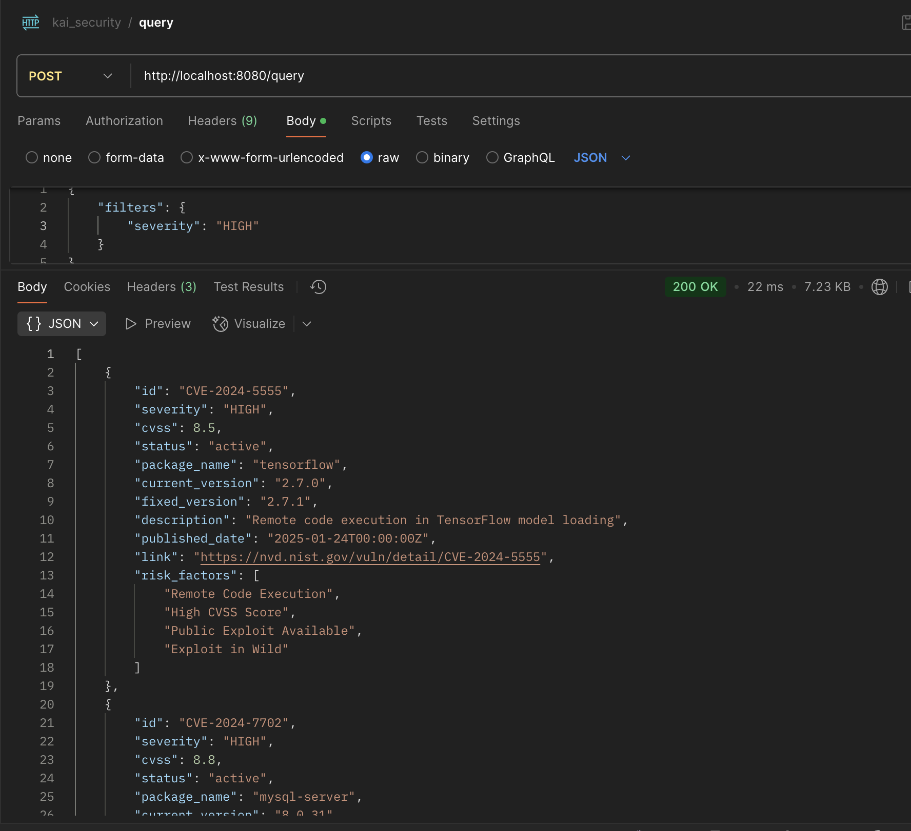
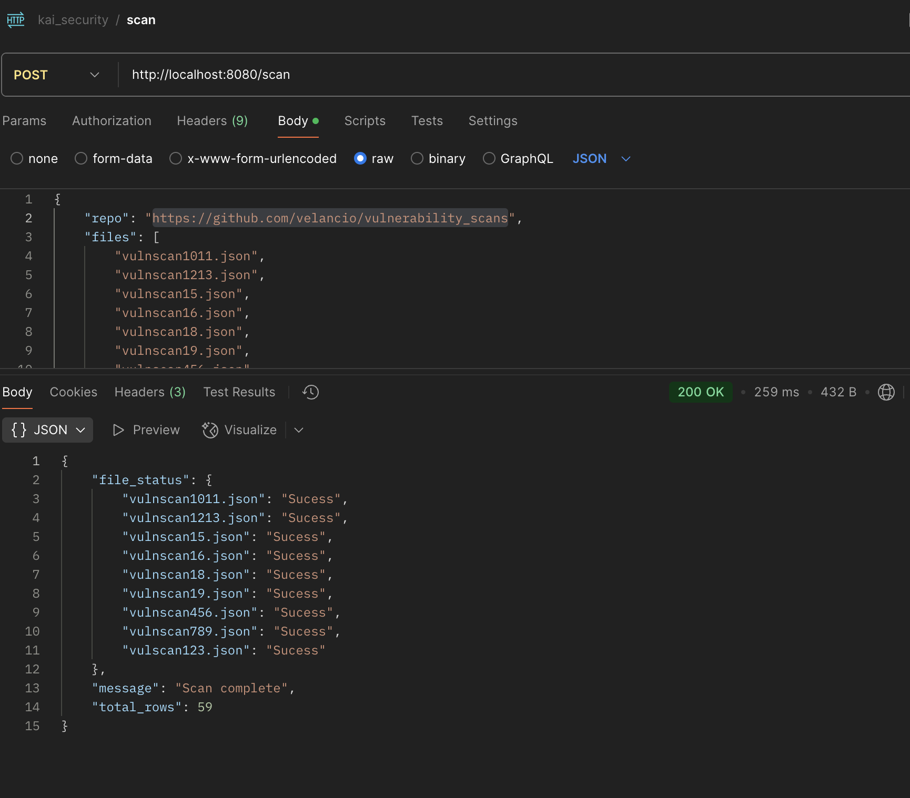

# Problem Statement

Build a single Go service with two REST APIs to:

Scan the GitHub repository ( https://github.com/velancio/vulnerability_scans ) for JSON files and store their contents.
Query stored JSON payloads using key-value filters.

# Codebase
```
.
├── Dockerfile 
├── README.md
├── build.sh // build docker image and run it with your port 8080 mapped
├── db.go  // functions related to sqlite databases
├── go.mod
├── kai_security.postman_collection.json // postman collection
├── go.sum
├── handlers.go // implementation of handlers
├── main.go // starting point
├── run.sh // run locally assuming you have golang 1.23 installed
├── utils.go // implementation of common functions
└── utils_test.go // test cases for utils.go

```

Here I have used `gin` framework for implementations of REST API web server. For database I have use `sqlite`. `main.go` will consist of gin server implementation. All implemetation of query and scan API are written in `handler.go`. `utils.go` will consist of implementation some commonly used functions. 

## Few Assumptions
- For all scan API hits , previous data will be deleted and reloaded as per the file list in request ( to prevent duplication for multiple hits )


# Running a locally

Make sure you have docker desktop installed and running and port 8080 is free (no other service using port 8080)

```

chmod +x build.sh

./build.sh  

```

# Running test cases

```

go test

```

# REST API

Use postman collection to hit APIs when running

# Screenshots

## Query API


## Scan API



